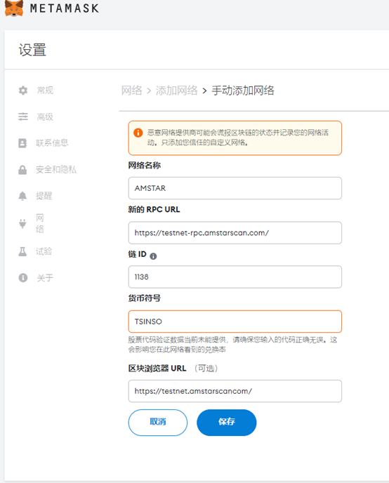

SINSO 分布式缓存测试网建立在 Amstar 测试网之上，因此您必须使用测试网的 TSINSO 为您的节点提供资金。

## 如何从 AMSTART 测试网接收 TSINSO？

Amstar 测试网水龙头 URL： https://faucet-testnet.amstarscancom/

## 如何从 SINSO 测试网接收节点 Staking Token TSINSO？

目前，SINSO 测试网对所有用户开放。

用户可以下载对应的 sinso 挖矿程序，然后按照教程启动节点后，就可以去领取对应节点的测试质押币
目前仅支持连接 Metamask 钱包的授权签名（Metamask 插件需要连接 PC 端接收）。

SINSO 质押浏览器：https://testnet.sinso.io/

提示：

点击下载 Chrome 浏览器：

https://www.google.com/intl/en-US/chrome/browser-features/#extensions

Metamask 插件下载地址：

https://chrome.google.com/webstore/search/metamask?hl=en

# 添加 amstar 网络

Chain Name：AMSTAR TEST

PRC URL:

https://testnet-rpc.amstarscan.com/

Chain ID:1138

Coin Symbol: TSINSO

Browser：https://testnet.amstarscancom/

