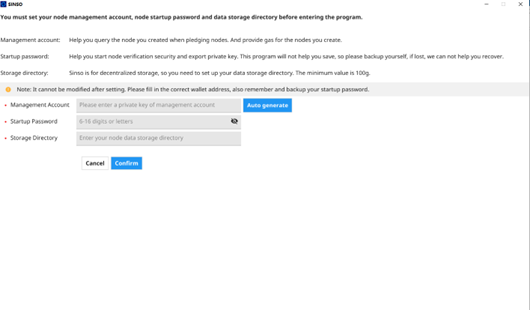
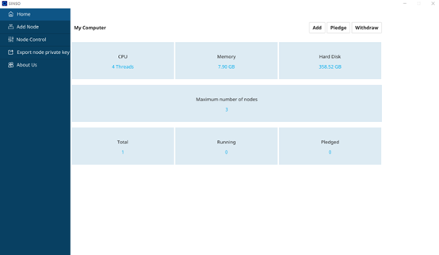
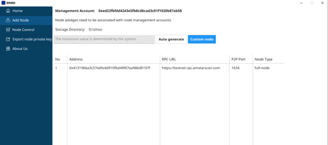
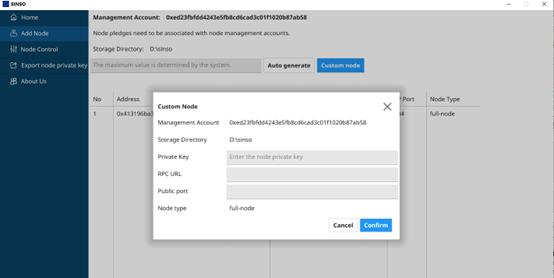
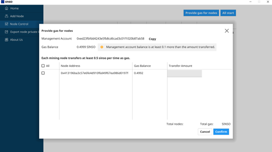
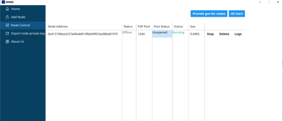
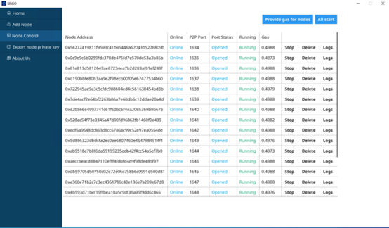
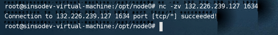
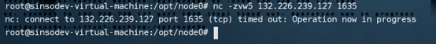
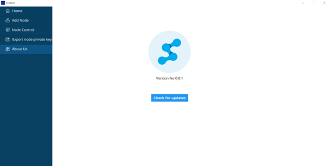

To install the sinso node, you need to complete the following procedure

1. Install the sinso GUI mining program

2. Configure the sinso parameter

3. Run sinso

4. Add the sinso node

5. Use SINSO token to provide funds for your node for main network interaction

6. NAT address

7. Start the sinso node and check whether your sinso is working

## Install sinso

Currently supported systems:

1. Ubuntu 18.04

2. Windows 10

3. Mac (Intel chip)

# Download

To install the. exe file using our Express Installer, please download it at the following link

Ubuntu 18.04 Download address:

https://github.com/sinsoio/sinso-mine-ui/releases/download/v0.0.1/mine-ui-ubuntu-amd64.tar.gz

Windows 10 Download address:

https://github.com/sinsoio/sinso-mine-ui/releases/download/v0.0.1/mine-ui-windows-amd64.tar.gz

Mac （Intel chip） Download address:

https://github.com/sinsoio/sinso-mine-ui/releases/download/v0.0.1/mine-ui-mac-intel.tar.gz

## Configure sinso

The first time you start sinso, you need to configure it to meet your needs.

Edit Configuration Information

1. Node management account

Helps you query the nodes you created when pledging nodes. It also provides gas for the nodes you create

2. Node startup password

Help you start the node to verify security and export private keys. This password program will not be saved for you, so please back it up by yourself. If it is lost, we can't help you to retrieve it

3. Data storage directory

Sinso is decentralized storage, so you need to set your data storage directory. The minimum is not less than 100g.



## Running sinso

After SINSO is configured, the performance of your device running sinso will be displayed, which will directly lead to the number of sinso nodes that your device can set up.



## Add sinso node

You can directly enter a number less than or equal to the number prompted by the system, and click Auto Generate after input



Of course, you can also manually configure your sinso node



## Funding your nodes

After the Sinso node is configured, you need to provide funds for your node before the next step of sinso node startup. SINSO is used as the consumption of gas on the chain. You can get the corresponding SINSO GAS through the faucet



After the above steps are completed successfully, you can start your node



## NAT address

Sinso excitation network is about sharing and storing data. To enable other nodes to connect to your node, you must broadcast your public IP address and ensure that the node is accessible on the correct p2p port. We recommend that you manually configure your external IP and check the connection to ensure that your node can receive connections from other nodes.

- You can check whether your Internet port has been opened by displaying the status of the Internet port on the interface.



If the interface shows that it is not open, you can also check it in the following way

First, determine your public IP address. Different systems have different detections. Let's take Ubuntu 18.04 as an example. (Other systems can search relevant operations online)

Command line input:curl icanhazip.com

```html preview
curl icanhazip.com
```

After accessing, you will get an IP address, which is your Internet IP address

```html preview
123.123.123.123
```

Then configure according to the node p2p port assigned by the system (for example, the port is 1634)

```html preview
nat-addr: “123.123.123.123 1634”
```

Check whether your node's p2p port is open. You can also judge by the following operations:

```html preview
nc -zv 123.123.123.123 1634
```

If the following message appears, the port is open



If the following information appears, it means that the port is not opened or the network is wrong



be careful

1. If the server has an independent Internet IP address, check whether the p2p port of the server to be configured is available on other servers. If not, check whether the machine and network have firewalls.

2. If there is no independent IP, you need to configure port mapping on the router or the network entrance device of the computer room. The external IP: port is mapped to the internal IP: port of the server that needs to open a port. Check whether the set internet ip: port is connected to other servers.

## Join sinso

If everything goes well, you will see that your node is officially working, and the external network port is also smooth and running normally.

Now your node will start to request the data blocks that belong to your responsibility -- then you will provide data to other p2p clients running in SINSO. Next, your node will begin to respond to requests from other nodes for these blocks, and you will soon get rewards in SINSO。

## Warning

When running SINSO for the first time, the system will ask you to automatically create or import a node management address. If you are importing, you need to import the private key of the address. Don't worry. Because SINSO is a decentralized network, there will be no centralized processing to steal your private key. The same is true when manually adding nodes.

## Pledge reward

SINSO will call the workload proof contract every 4 hours to check whether you are online, whether the whole network data block is stored, and whether the node has pledge currency. If all the requirements are met, you will receive corresponding workload rewards.

## Blockchain RPC Endpoint

Your sinso node must be able to stably access the amstar Chain RPC endpoint, so that it can interact and deploy with your node. Our system will automatically allocate the amstar Chain RPC endpoint, without the user having to manually configure it.

## Upgrade sinso

To upgrade, directly enter the about us interface, click check for updates. The system will prompt you whether it is the latest version, if not, you can click to download the update


